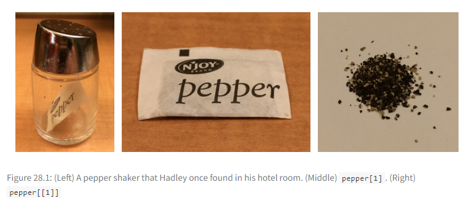
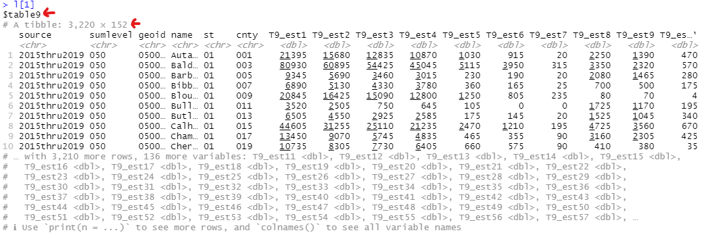

```{r setup, include=FALSE}
knitr::opts_chunk$set(echo = TRUE)
```

Lists can not only store a mix of data types, but also more complex data (e.g. data frames, even lists themselves!). It's an ideal option for a group of similar complex data, and decently sets us up for iteration! So in preparation for `for` loops, let's examine lists and how to extract data from them.

# Create a list

```{r eval=FALSE}
# an empty list
l <- list() 

# populated with objects
l <- list(file_01, file_02, file_03) 
```

# Anatomy

There's several layers to a list, like a container within a container. To extract a specific element's data, use double brackets instead one.

```{r eval=FALSE}
l # the whole list and all its elements

l[1] # the first element in its container; contains the name/index of element and the data

l[[1]] # the data of the first element

```

Hadley Wickham's pepper analogy



## Names

Like vectors, lists can also be named

```{r eval=FALSE}
names(l) <- c('table9', 'table10', 'table11')
```

Now you can also access the data of a specific element by name using $ or [[]]
 
```{r eval=FALSE}
l$table9

l[['table9']]

# saving processes back into the list
l$table9 <- l$table9 %>% filter(cnty == '033')
```

Now if you extract an element with only one `[]` like `l[1]`, you can see that it's a container holding the name of the element and the data itself.




