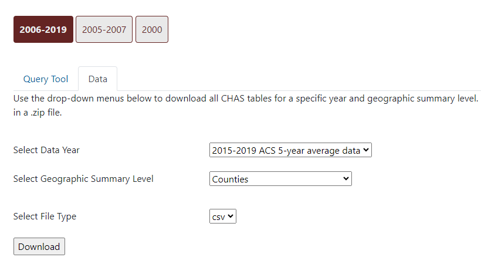

```{r setup, include=FALSE}
knitr::opts_chunk$set(echo = FALSE)
```

We'll be going over Functions, Lists, and Loops in this session. Some familiarity with using R and opening RStudio is helpful if you are actively participating, otherwise all are welcome to watch and learn.

R and the RStudio IDE are required. See the first module on [R Basics](https://psrc.github.io/r-basics-I/00-index.html) for guidance.

# Session Files on Local Drive

1. Clone the repo `` onto your local drive.

2. Download the CHAS zip file of the `2015-2019 ACS 5-year average data` for `Census places` from [here](https://www.huduser.gov/portal/datasets/cp.html#data_2006-2019). 

Extract the files into in the `data` sub-directory of the cloned repo.



Make sure that the repo and other files for the session are **on your local drive**. If they are on PSRC's network, you may experience extreme sluggishness when using a `.Rproj` file.

## Open .Rproj

In the RStudio IDE, open the `.Rproj` file. Project files will automatically set our working directory--in this case, the root of the  directory. No need for `setwd()` and dealing with file paths!


After opening the `.Rproj` file, you'll see some changes to your IDE. Your console and `Files` pane will reflect the new working directory, and the project name is listed in the top right corner.


To close out of the project, click the project name at the top right corner and select `Close Project`. On the day of the session, you can access the dropdown in that area of the IDE and select ``.

<div class="adjacent-image">
<div class="image-left">

</div>
<div>

</div>
</div>

# Install

If the following packages have not been installed, install the following by running the following code snippet in the console of your RStudio IDE. Ignore any warnings regarding `Rtools` and if you are asked to install from sources which needs compilation, click 'No'. 

<aside>
Some may have already been installed from previous modules. You can adapt the code snippet accordingly.
</aside>

```{r eval=FALSE, include=TRUE}
install.packages(c('tidyverse', 'here'))
```


