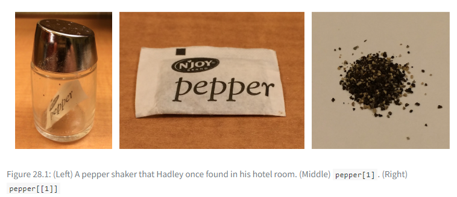

```{r xaringan-extra, echo=FALSE, warning=FALSE}
library(xaringanExtra)
library(fontawesome)
use_tile_view()
use_panelset()
use_tachyons()
use_editable(expires = 1)
```

```{r setup, include=FALSE}
options(htmltools.dir.version = FALSE)
```

```{r xaringan-themer, include=FALSE, warning=FALSE}
library(xaringanthemer)
style_mono_accent(
  base_color = "#1c5253",
  header_font_google = google_font("Poppins"),
  text_font_google   = google_font("Poppins", "300", "300i"),
  code_font_google   = google_font("Fira Mono")
)
```

.pull-left[
## Why organize code?
```{r eval=FALSE}

# An example of unorganized code

df_2019 <- dataset %>% filter(year == 2019)

df_2021 <- dataset %>% filter(year == 2021)

df_2023 <- dataset %>% filter(year == 2023)

```
]

.pull-right[

## Lots of benefits

- potentially less lines of code

- readability (yourself & others)

- ease in debugging

- memory space

- less variables to name!
]

---
class: inverse, center, middle


# Functions

---

## Functions

.pull-left[
- Can reduce repetitive code

- Even a one-time use function is a good way to break up code

- A mini environment within the function. Variable names used inside the function won't affect global environment variables. Less names to think or keep track of!
]

.pull-right[

]

---

### Create your function

.pull-left[
**Defining your function**
.can-edit[
```{r}

my_function_name <- function() {
  

  
}
```
]
]

.pull-right[
**Call your function**
.can-edit[
```{r}

x <- my_function_name()

```

]
]

---

class: inverse, center, middle

# Exercise

---

### Exercise (5 minutes)

.panelset[
.panel[.panel-name[Exercise]
Let's create a function that when called, does the following to any CHAS table: 
.pull-left[
- Filter for WA state and PSRC counties

- Pivot longer (so columns that start with **T** are not across the table, but contained in a single column)

Extra credit:
- Create 3 more columns that dissect the column containing the former **T...** headers: 
    - create **table** field extracting `T` and the numbers before the underscore
    
    - create **type** field extracting 'est' or 'moe'
    
    - create **sort** field extracting the numeric digits from the end
]


.pull-right[
.can-edit[
```{r eval=FALSE}

clean_table <- function(table) {
 
     
}

```
]
]

]

.panel[.panel-name[End Output]

]

.panel[.panel-name[Resources]

- [Stringr](https://stringr.tidyverse.org/)
- [Stringr Cheat Sheet](https://github.com/rstudio/cheatsheets/blob/main/strings.pdf)

]

]

---

class: inverse, center, middle

# Lists

---

# Lists

- A fancy container of stuff!

- Can help reduce number of objects in the global environment

- Fun when used with loops

.pull-left[
### Vectors

- Vectors group individual values of the same data type 
  - `c('a', 'b', 'c')`

- It will force everything to be the same data type and will try to flatten more complex types (e.g. data frames)
]

.pull-right[
### Lists
- Lists can store different objects or individual values 
  - `list('a', my_dataframe, another_list)`

- Stores any types (or a mix of types) and retains their structure.

]

---

# Accessing a list

.pull-left[
Hadley Wickham's pepper example<sup>1</sup>:

1. `my_list`: The whole list and all its elements

2. `my_list[1]`: A container of the first element (name of element and the data/value)

3. `my_list[[1]]`: The actual data
]

.pull-right[

]

.footnote[[1] https://r4ds.hadley.nz/base-r#lists]

---

class: inverse, center, middle

# Loops

---

# Loops

- Reduce redundant code when applying the same actions to multiple things

Examples: 
- Iterate through a list of your objects applying the same changes

- Iterate through a list of files, consolidating into one data frame

- Reading in or exporting files

- Printing

.flex.justify-center[


.mh3[]


]    
---

## Loop Structure

**Set-up**
.can-edit[
```{r eval=FALSE}

for(<iterator> in <list or vector>) {
  
}
```
]

---


